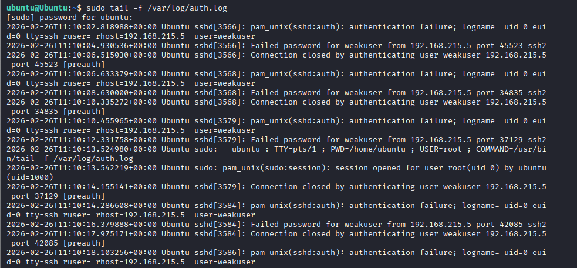
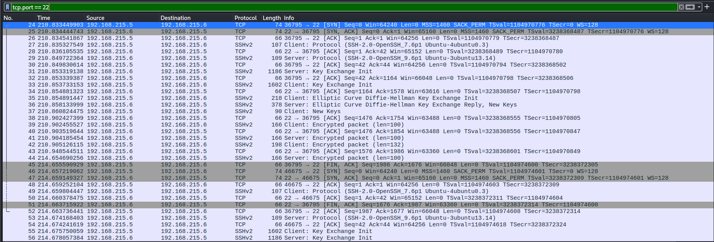
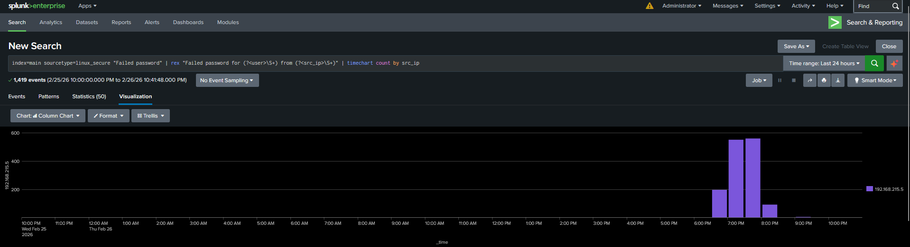
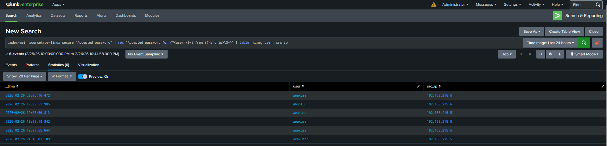
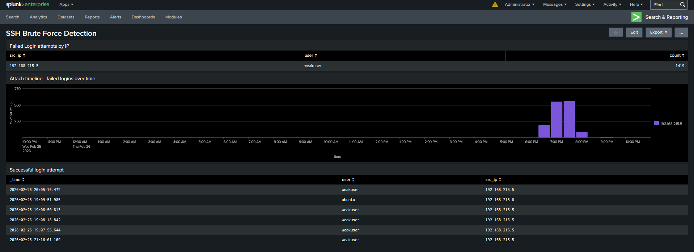

# Incident Report: SSH Brute-Force Attack Detection
**Date:** February 26, 2026  
**Author:** Tareq Azhad  
**Environment:** Home Lab (VirtualBox)  
**Classification:** Lab Exercise — SOC Investigation Simulation

---

## 1. Executive Summary

A simulated SSH brute-force attack was conducted against an Ubuntu Server 24.04.4 LTS target machine from a Kali Linux attacker machine within an isolated VirtualBox lab environment. The attack was executed using Metasploit's `auxiliary/scanner/ssh/ssh_login` module, which systematically attempted passwords from a wordlist against a known username until valid credentials were found.

The attack generated 1,419 failed authentication attempts against the `weakuser` account before successfully compromising the credentials `weakuser:password123`. The attack was fully visible through three detection layers: raw Linux authentication logs (`/var/log/auth.log`), network packet capture in Wireshark, and a purpose-built Splunk SIEM dashboard with threshold-based detection logic.

This report documents the complete attack chain from initial reconnaissance through credential compromise, along with all detection evidence and recommended mitigations.

---

## 2. Lab Environment

| Component | Details |
|---|---|
| Attacker Machine | Kali Linux (VirtualBox VM) — `192.168.215.5` |
| Target Machine | Ubuntu Server 24.04.4 LTS (VirtualBox VM) — `192.168.215.6` |
| Network | VirtualBox Host-Only + NAT (isolated lab network) |
| SIEM | Splunk Enterprise (Windows host) |
| Log Forwarding | Splunk Universal Forwarder on Ubuntu |
| Tools Used | Nmap 7.95, Metasploit Framework, Wireshark, Splunk Enterprise |

---

## 3. Attack Timeline

| Time (UTC+8) | Event |
|---|---|
| 05:40:22 | Nmap reconnaissance scan initiated against `192.168.215.6` |
| 05:40:32 | Nmap scan completed in 10.11 seconds — 3 open ports identified |
| 11:10:02 | SSH brute-force attack started — first failed attempt recorded in auth.log |
| 11:10:02 — 19:07:55 | 1,419 failed login attempts against `weakuser` from `192.168.215.5` |
| 19:07:55 | Credentials successfully cracked — `weakuser:password123` |
| 19:07:55 — 20:05:16 | Multiple successful SSH sessions established from attacker to target |

---

## 4. Reconnaissance

### 4.1 Nmap Service Version Scan

An initial service version scan was performed against the target to enumerate open ports and identify running services before selecting an attack vector.

**Command used:**
```bash
nmap -sV -sC -oN initial_scan.txt 192.168.215.6
```


The scan completed in **10.11 seconds** and identified three open services:

| Port | State | Service | Version |
|---|---|---|---|
| 21/tcp | open | FTP | vsftpd 3.0.5 |
| 22/tcp | open | SSH | OpenSSH 9.6p1 Ubuntu 3ubuntu13.14 |
| 80/tcp | open | HTTP | Apache httpd 2.4.58 (Ubuntu) |

The `-sC` flag also retrieved the SSH host key fingerprints (ECDSA and ED25519), which can be used to confirm target identity in later investigation steps. The HTTP service was identified as running the Apache2 Ubuntu default page, indicating a freshly configured web server with no custom application deployed.

**Attack vector selected:** Port 22 (SSH) was chosen as the primary attack surface. SSH brute-force is a common real-world attack vector, and the presence of a weak user account (`weakuser`) on the target made it an ideal candidate for credential abuse testing.

---

## 5. Exploitation

### 5.1 SSH Brute-Force Attack via Metasploit

Metasploit's `auxiliary/scanner/ssh/ssh_login` module was configured and executed against the target SSH service. This module automates credential testing by attempting each password in a supplied wordlist against a specified username.

**Module configuration and execution:**


The screenshot above shows the full attack execution. Key observations:

- The module was configured with `RHOSTS 192.168.215.6`, `USERNAME weakuser`, `PASS_FILE /tmp/shortlist.txt`, `THREADS 10`, `STOP_ON_SUCCESS true`, and `VERBOSE true`
- Red `[-]` lines indicate failed password attempts: `weakuser:admin`, `weakuser:123456`, `weakuser:password`, `weakuser:letmein`, `weakuser:welcome` were all rejected
- The green `[+]` line confirms successful credential discovery: `weakuser:password123`
- Upon success, Metasploit automatically opened an SSH session (`SSH session 1 opened`) from `192.168.215.5:42703` to `192.168.215.6:22` at `2026-02-26 08:16:02`
- System information was retrieved from the target: `Linux Ubuntu 6.8.0-101-generic x86_64`

### 5.2 Compromised Credentials Summary

| Field | Value |
|---|---|
| Username | `weakuser` |
| Password | `password123` |
| Source IP | `192.168.215.5` (Kali attacker) |
| Target IP | `192.168.215.6` (Ubuntu target) |
| Target Port | 22 (SSH) |
| Session opened | 2026-02-26 08:16:02 UTC |

---

## 6. Detection Evidence

### 6.1 auth.log — Host-Based Detection

Real-time monitoring of `/var/log/auth.log` on the target machine captured the brute-force activity at the operating system level. This is the primary host-based detection source for SSH attacks on Linux systems.



The log reveals a clear and repeating pattern characteristic of automated brute-force tooling:

- Each attempt generates two log entries: a `pam_unix(sshd:auth): authentication failure` line followed by a `Failed password for weakuser from 192.168.215.5` line
- All attempts originate from the same source IP (`192.168.215.5`) but use different source ports (`45523`, `34835`, `37129`, `42085`), this is typical of automated tools opening a new TCP connection per attempt
- The `Connection closed by authenticating user weakuser [preauth]` entries confirm the connection was terminated immediately after each failed attempt, consistent with Metasploit's behavior
- The high frequency of attempts — multiple per second — is not consistent with human login behavior and is a strong indicator of automated tooling

A single legitimate SSH login attempt would appear as one or two log entries. The volume and pattern seen here is a definitive indicator of brute-force activity.

---

### 6.2 Wireshark — Network-Based Detection

Wireshark was used to capture network traffic on the Host-Only interface during the attack. Filtering by `tcp.port == 22` isolated all SSH traffic between the attacker and target.



The packet capture reveals the full SSH handshake cycle being repeated for each brute-force attempt:

- Each attempt follows the same sequence: `[SYN]` → `[SYN, ACK]` → `[ACK]` → SSH protocol negotiation → Key Exchange → Elliptic Curve Diffie-Hellman exchange → encrypted packets → `[FIN, ACK]` to close the connection
- The fact that full SSH handshakes are being completed before failing indicates these are legitimate SSH login attempts rather than a simple port scan or SYN flood
- Rows highlighted in grey show `[FIN, ACK]` packets — connection teardowns — immediately followed by new `[SYN]` packets from a new source port, confirming the rapid cycle of connect → attempt → disconnect → reconnect that characterises brute-force activity
- Both `192.168.215.5` (Kali) as source and `192.168.215.6` (Ubuntu) as destination are clearly visible, establishing attacker and victim identity at the network layer

---

### 6.3 Splunk SIEM — Centralized Detection and Alerting

Authentication logs were forwarded from the Ubuntu target to Splunk Enterprise via Splunk Universal Forwarder, enabling centralized analysis and dashboard-based detection. Three detection queries were built to identify and visualize the attack.

---

#### Panel 1: Failed Login Count by IP and User

**SPL Query:**
```
index=main sourcetype=linux_secure "Failed password" | rex "Failed password for (?<user>\S+) from (?<src_ip>\S+)" | stats count by src_ip, user | where count > 5
```


This query extracts the source IP and username from raw log text using a regex pattern, then counts failed attempts per IP/user combination. The `where count > 5` clause acts as the **detection threshold** — any source IP with more than 5 failed attempts is flagged as suspicious.

The results show **1,419 failed login attempts** against `weakuser` from `192.168.215.5` within the 24-hour search window. This count is orders of magnitude above the threshold of 5, making this an unambiguous detection. In a real SOC environment, this query would be configured as an automated alert to notify analysts in real time.

---

#### Panel 2: Attack Timeline — Failed Logins Over Time

**SPL Query:**
```
index=main sourcetype=linux_secure "Failed password" | rex "Failed password for (?<user>\S+) from (?<src_ip>\S+)" | timechart count by src_ip
```



This timechart visualizes the failed login volume over time, grouped by source IP. The chart clearly shows:

- Zero activity from 10:00 PM (Wed Feb 25) through approximately 6:00 PM (Thu Feb 26) — this represents the normal baseline with no brute-force activity
- A sharp spike beginning around 6:30–7:00 PM reaching approximately 250 failed attempts, corresponding to the first brute-force run
- Peak attack volume between 7:00 PM and 8:00 PM with two consecutive buckets reaching approximately 500–550 attempts each, the highest intensity phase of the attack
- A declining tail after 8:00 PM with a smaller spike around 100 attempts, followed by near-zero activity, corresponding to the final short wordlist run that successfully cracked the password

This timeline pattern is a textbook brute-force signature: a sudden onset of high-volume failed logins from a single source IP with no preceding activity.

---

#### Panel 3: Successful Login Detection

**SPL Query:**
```
index=main sourcetype=linux_secure "Accepted password" | rex "Accepted password for (?<user>\S+) from (?<src_ip>\S+)" | table _time, user, src_ip
```



This query captures all successful SSH authentications, providing visibility into the moment of credential compromise. The results show **6 accepted password events**, with notable findings:

- The earliest successful login for `weakuser` from `192.168.215.5` occurred at **19:07:55** — this is the exact moment the brute-force succeeded
- Multiple subsequent successful logins for `weakuser` from `192.168.215.5` at `19:08:18`, `19:08:50`, and `20:05:16` — indicating the attacker returned and re-authenticated multiple times after the initial compromise
- One entry shows `ubuntu` logging in from `192.168.215.6` at `19:09:51` — a localhost login from the target machine itself (normal administrative activity), demonstrating the query's ability to distinguish between attacker and legitimate logins by source IP
- The concentration of `weakuser` logins from `192.168.215.5` immediately following the brute-force spike in Panel 2 provides a complete kill chain picture: brute-force → credential compromise → repeated access

---

#### Full Dashboard View



The complete `SSH Brute Force Detection` dashboard consolidates all three panels into a single view, providing a SOC analyst with an at-a-glance picture of the attack. The failed login count table, attack timeline chart, and successful login table are visible simultaneously, enabling rapid triage and correlation without needing to run individual queries.

---

## 7. Key Findings

- **1,419 failed authentication attempts** were made against `weakuser` from `192.168.215.5` before credentials were compromised
- The attack was detectable at three independent layers — host logs, network traffic, and SIEM — providing defence-in-depth visibility
- No account lockout policy was configured on the target, allowing unlimited login attempts with no automatic blocking
- The compromised password (`password123`) appears in common wordlists and would be cracked by any standard brute-force tool
- Following the initial compromise, the attacker re-authenticated 5 additional times, indicating persistent access to the target
- The attack was entirely visible in Splunk within minutes of log ingestion, confirming that threshold-based SIEM detection is effective for this attack type

---

## 8. Recommendations

**Immediate mitigations:**

1. **Enforce strong password policies** — require a minimum of 12 characters with complexity requirements. Passwords such as `password123` should be rejected at account creation
2. **Disable SSH password authentication entirely** — configure SSH to use key-based authentication only by setting `PasswordAuthentication no` in `/etc/ssh/sshd_config`
3. **Deploy fail2ban** — automatically ban source IPs that exceed a configurable failed login threshold (e.g., 5 attempts within 60 seconds), directly blocking brute-force attacks at the host level
4. **Implement account lockout** — configure PAM's `faillock` module to lock accounts after repeated failed attempts

**Detection and monitoring improvements:**

5. **Configure real-time Splunk alerting** — convert the failed login count query into a scheduled alert that notifies analysts when any source IP exceeds 10 failed attempts within a 5-minute window, rather than relying on manual dashboard review
6. **Restrict SSH access by IP** — use `ufw` firewall rules to whitelist known management IPs for SSH access and block all others
7. **Monitor successful logins following failed attempts** — the pattern of a brute-force spike immediately followed by a successful login is a high-confidence indicator of compromise and should trigger automatic escalation

---

## 9. Tools and References

| Tool | Version | Purpose |
|---|---|---|
| Kali Linux | Rolling | Attacker machine OS |
| Nmap | 7.95 | Network reconnaissance and service enumeration |
| Metasploit Framework | Latest | SSH brute-force attack (`auxiliary/scanner/ssh/ssh_login`) |
| Wireshark | Latest | Network traffic capture and packet analysis |
| Splunk Enterprise | 10.x | SIEM log aggregation, search, and dashboard |
| Splunk Universal Forwarder | 10.2.0 | Log forwarding from Ubuntu target to Splunk |
| `/var/log/auth.log` | — | Linux PAM authentication log (primary host evidence source) |
| Ubuntu Server | 24.04.4 LTS | Target machine OS |

---

*This report was produced as part of a cybersecurity home lab exercise simulating a SOC investigation workflow. All activity was conducted in an isolated VirtualBox environment. No real systems or networks were targeted.*
